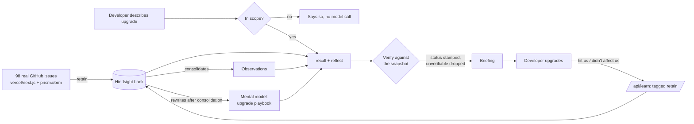

<p align="center">
  <a href="https://regression-radar.vercel.app">
    
  </a>
</p>

<p align="center">
  <a href="https://regression-radar.vercel.app"></a>
  <a href="https://github.com/vectorize-io/hindsight"></a>
  
  
  
</p>

<p align="center">
  <a href="https://regression-radar.vercel.app"><b>Try it live</b></a>
  &nbsp;·&nbsp;
  <a href="#watch-it-learn">Watch it learn</a>
  &nbsp;·&nbsp;
  <a href="#how-hindsight-memory-is-used">How the memory works</a>
  &nbsp;·&nbsp;
  <a href="#run-it-yourself">Run it yourself</a>
</p>

<br>

## 12 citations. Not one we could find.

We asked a capable general model, with no memory, what breaks when you take a Next.js 14.1 app with Prisma to 14.2. It answered with confidence and cited 12 GitHub issue numbers. We looked every one of them up in our snapshot of 98 real bug reports from that upgrade. None of them were there.

Regression Radar answers the same question from a memory of those real reports. Every issue it cites is checked against GitHub before you see it, and anything that can't be checked is left out. Then it does the part a stateless model can't: when you tell it what actually happened in your upgrade, the next developer gets a better answer.

<p align="center">
  
</p>

<sub>Left: the recorded no-memory answer from <code>openai/gpt-oss-120b</code>, 2 October 2026 (<a href="data/baseline-recorded.json"><code>data/baseline-recorded.json</code></a>). Right: what the live app returned for the same question on 4 October. "Not in the snapshot" means we couldn't verify the number. It doesn't prove the issue doesn't exist, so we never say it was made up.</sub>

## Why this exists

Whatever breaks in your upgrade has usually broken for somebody else first, and they wrote it down in a public issue tracker. Nobody reads a few hundred bug reports before bumping a version number, so teams keep walking into the same regressions.

Regression Radar reads them for you, remembers them, and keeps a running record of what actually hit the people who upgraded before you.

<h2 id="watch-it-learn">Watch it learn</h2>

<p align="center">
  
</p>

You ask about your upgrade and get a list of known breakages. After you upgrade, you tap **This hit us** or **Didn't affect us** on each one. That report goes into memory. Ask the same question again and the warning that hit you is first, marked *"Confirmed by 1 developer who did this upgrade"*. The one that didn't affect you drops to the bottom.

The reordering isn't left to the model's judgment. It's applied in code, because this is the part that has to be right every time ([design decision 2](#2-feedback-is-stored-as-structure-and-applied-in-code)).

## What you get back

```
POST /api/brief  { "stack": "Next.js 14.1 to 14.2, app router + Prisma" }
```

```jsonc
{
  "summary": "8 known breakages for this combination. 5 fixed, 3 still open.",
  "citations": { "total": 8, "verified": 8 },
  "risks": [
    {
      "title": "Inconsistent CSS resolution order",
      "status": "open",                 // from GitHub, never from the model
      "confidence": "high",
      "why": "layout.js imports override component-level CSS in production builds.",
      "sources": [{ "number": 64921, "url": "https://github.com/vercel/next.js/issues/64921" }],
      "feedback": { "hit": 0, "fine": 0 }
    }
  ],
  "memory_events": [ /* what memory was searched and what came back */ ],
  "playbook": { /* Hindsight's mental model for this upgrade, verified */ }
}
```

Then, after the upgrade:

```
POST /api/learn  { "stack": "...", "feedback": [ { "number": 66248, "happened": true },
                                                 { "number": 65454, "happened": false } ] }
```

Ask about something it has no data on, say *"React 17 to 18 with Vite"*, and it tells you so instead of guessing:

```jsonc
{ "summary": "Nothing in memory matches that stack yet. Memory currently covers Next.js 14.1 to 14.2, and Prisma on the Next.js App Router.", "risks": [] }
```

<h2 id="how-hindsight-memory-is-used">How Hindsight memory is used</h2>

It's built on [Hindsight](https://github.com/vectorize-io/hindsight), an [agent memory](https://vectorize.io/what-is-agent-memory) system by Vectorize. Take the memory away and you get the left side of the picture above. Every answer draws on four kinds of memory, and each one does a separate job.

| Memory | What it holds here | How it gets there |
|---|---|---|
| **World facts** | What each of the 98 bug reports says: symptom, affected versions, workaround, fix | `retain()` of each cleaned issue. Hindsight's own extraction decides what counts as a fact. We never hand-sort. |
| **Observations** | Patterns across reports, e.g. several separate Prisma issues all failing the same way in edge runtimes | Consolidated automatically by Hindsight from the world facts. A query on 4 October recalled **70 memories: 57 facts and 13 observations**. |
| **Developer reports** | "Issue #66248 DID happen to me", "#65454 did NOT affect me" | `/api/learn` retains each verdict with structured tags (`issue:66248`, `happened:yes`). Hindsight files these as world facts too, and consolidates them. |
| **Mental model** | A standing playbook: what usually breaks in this upgrade, grouped by area | `create_mental_model()` with a source query and `refresh_after_consolidation: true`. Hindsight rewrites it on its own. We watched it rewrite **22 seconds** after a developer report came in, and the new version mentioned that report. |

**The loop:**



Every response includes `memory_events`, a record of exactly what memory did for that answer. The interface shows it live in the Memory Inspector. From one run:

```
recall   searched memory, found 80 relevant memories       {world: 48, observation: 32}
recall   found 2 reports from developers who already did this upgrade
reflect  reasoned over 80 memories, produced 7 candidate risks
recall   loaded the mental model "What breaks upgrading Next.js 14.1 to 14.2...", rewritten by Hindsight at 08:56 UTC
reflect  applied developer reports: 1 warning confirmed, 1 marked as did not happen
reflect  dropped 1 citation not present in the 98-issue snapshot
```

`reflect()` doesn't report which memories it used, so the API runs `recall()` itself first. That way the inspector shows what actually came back instead of claiming it.

## Design decisions

### 1. Memory decides what's relevant. The snapshot decides what's true.

In the first working version, the model labelled **3 of 10** closed issues as still open (#64603, #66248, #64609). It was reading people write "still broken" in comments from months before the fix. It also cited #71281, which isn't in the dataset.

So `reflect()` is never asked whether something is fixed. It returns issue numbers only, through a `response_schema`. Every status is stamped from the committed snapshot in [`lib/groundTruth.ts`](lib/groundTruth.ts), and any citation that isn't in the snapshot is dropped. A result you can't click through to is worse than one fewer result.

The mental model gets the same treatment. Its first draft repeated the wrong status labels and cited "#84901675" (an impossible number) for a problem whose real issue is #66248. Its text is now checked the same way before it's shown.

### 2. Feedback is stored as structure and applied in code

The first version of the learning loop passed developer outcomes to the model as context and asked it to act on them. It didn't. A warning a developer had confirmed came back with no mention of the confirmation, and a single report was counted as six, because Hindsight splits one report into several facts and observations. And since the model chose which warnings to include, nothing stopped a confirmed warning from dropping out of a later answer.

Now each verdict is its own memory with structured tags, counted **once per report** on recall. The tally is applied deterministically:

- confirmed warnings go to high confidence and first place, and can't drop out of later answers
- warnings developers said didn't affect them go to low confidence and last place

`/api/learn` only accepts issue numbers that exist in the snapshot, so the public endpoint can't write numbers from outside the snapshot into shared memory.

### 3. The before/after is a number, not an adjective

`/api/baseline` sends the same question, with no memory, to a capable general model (`openai/gpt-oss-120b` on Groq) and runs the same verification on its answer.

| | Issue numbers cited | Verifiable against the snapshot |
|---|---|---|
| Memory off (across our runs) | 0–12 | **0, every time** |
| Memory on (across our runs) | 4–12 | **all shown** (unverifiable ones are dropped) |

Early runs capped the answer at 900 tokens. That cap also covers the model's hidden reasoning, so some answers were cut off before they cited anything. The cap is now 4,000. Given room to finish, the model cited 12 issue numbers, and none of them could be verified.

The public site serves that complete run, recorded on 2 October 2026, instead of calling the model on every check, so anyone with the link isn't spending model quota. The interface labels it as recorded. Set `BASELINE_LIVE=on` to call the model live.

### 4. It says when it doesn't know

Verification proves a cited issue exists. It doesn't prove the issue answers your question. Asked about *"React 17 to 18 with Vite and Redux"*, an earlier version returned five Prisma and Next.js issues, every one of them real and every one "verified".

So the scope rule lives in code too. A stack that names neither Next.js nor Prisma gets "nothing in memory matches" straight away, without a model call. A Next.js version outside 14.1 to 14.2 still gets the nearest reports, with a note saying they aren't a record of that exact upgrade.

## The data

98 real issues, pulled by [`fetch_bug_reports.py`](fetch_bug_reports.py) and committed as [`raw_issues.jsonl`](raw_issues.jsonl):

| | |
|---|---|
| Sources | 25 from `vercel/next.js`, 73 from `prisma/orm` |
| State | 56 open, 42 closed |
| Created | 2024 onwards (Next.js 14.2 shipped April 2024) |
| With discussion | 84 include top comments, which is usually where the fix or workaround is |
| Duplicates / pull requests | 0 / 0 |

Nothing is fetched live while the app runs. The snapshot is the source of truth for status.

<details>
<summary><b>What went wrong getting it</b></summary>
<br>

- GitHub's `search/issues` returns pull requests as well as issues. The first dataset was full of PRs until every query carried `is:issue`.
- Every Prisma query failed with HTTP 422. The repository was renamed from `prisma/prisma` to `prisma/orm`, and GitHub search's `repo:` qualifier doesn't follow the redirect.
- Sorting by "recently updated" surfaced Next.js 15 and 16 issues for a 14.2 question. Relevance ranking plus `created:>2024-01-01` fixed it.
- A token placed in `.env` was silently ignored, so the first full run crawled at 60 requests an hour instead of 5,000.

</details>

<h2 id="run-it-yourself">Run it yourself</h2>

```bash
git clone https://github.com/ekupekuAI/regression-radar.git
cd regression-radar
cp .env.example .env          # fill in the values below
npm install
pip install hindsight-client

python fetch_bug_reports.py            # or use the committed raw_issues.jsonl
python load_to_hindsight.py init       # create the bank with its mission
python load_to_hindsight.py load       # retain all 98 issues
python load_to_hindsight.py mental-model
npm run dev                            # http://localhost:3000
```

| Variable | Purpose |
|---|---|
| `HINDSIGHT_API_URL`, `HINDSIGHT_API_KEY` | Hindsight Cloud instance. The loader and the app must point at the same one. |
| `GROQ_API_KEY` | The memory-off baseline (`openai/gpt-oss-120b` on Groq), used only when `BASELINE_LIVE=on` |
| `BASELINE_LIVE` | `on` calls the model live for the memory-off baseline. Anything else serves the recorded run. |
| `GITHUB_TOKEN` | Only for re-fetching the data |

`python load_to_hindsight.py reset-feedback --yes` deletes every document that isn't part of the snapshot and has Hindsight rewrite the playbook. Run it before showing the before/after to someone new, so it starts from a memory nobody has given feedback to yet. Without `--yes` it's a dry run.

<details>
<summary><b>API reference</b></summary>
<br>

| Endpoint | Body | Returns |
|---|---|---|
| `POST /api/brief` | `{ stack }` | `risks[]`, `citations`, `memory_events[]`, `playbook` |
| `POST /api/learn` | `{ stack, feedback: [{ number, happened }], outcome? }` | `recorded`, `rejected`, `memory_events[]` |
| `POST /api/baseline` | `{ stack }` | the no-memory `answer`, `citations`, and `recorded` when it's the recorded run |

</details>

**Stack:** Next.js 14 (App Router) on Vercel · Hindsight Cloud for memory (`retain`, `recall`, `reflect`, mental models) · Groq for the no-memory baseline · Python for the data pipeline.

## Limitations

- **Scope is one upgrade path,** on purpose: Next.js 14.1 to 14.2 with the App Router and Prisma. Ask about anything else and it says so instead of guessing. Covering any stack means a much larger ingest and per-stack verification.
- **"Closed" is treated as "fixed".** GitHub's `state_reason` would separate *completed* from *not planned*. That's the next thing to add.
- **Feedback is anonymous and unweighted.** One report counts the same as any other. At scale that needs identity and weighting.
- **Answers vary between runs.** The model is guided toward the 5–8 most relevant results, but which ones make the cut still shifts a little. Confirmed warnings are pinned, so they never drop out.

## Team

Built by **Let Us Cook**.

| | Role | Article | LinkedIn | Reddit |
|---|---|---|---|---|
| **Ekansh** | API, verification, data pipeline | [Hindsight finds the bug reports. My code decides what's true.](https://dev.to/ekansh2008/hindsight-finds-the-bug-reports-my-code-decides-whats-true-360f) | [Post](https://www.linkedin.com/feed/update/urn:li:activity:7510398203381506048/) | [r/LLMDevs](https://www.reddit.com/r/LLMDevs/comments/1wslzfp/hindsight_finds_the_bug_reports_my_code_decides/) |
| **Shreya** | Memory design, Memory Inspector, interface | [I tried sorting agent memory by hand. Hindsight did better.](https://dev.to/shreyaagraa/i-tried-sorting-agent-memory-by-hand-hindsight-did-better-1old) | [Post](https://www.linkedin.com/feed/update/urn:li:activity:7510396652134752257/) | [r/AIMemory](https://www.reddit.com/r/AIMemory/comments/1wsm0st/i_tried_sorting_agent_memory_by_hand_hindsight/) |
| **Chandana** | Research and evidence | [Dependabot gives pass rates. Our Hindsight agent remembers what broke.](https://dev.to/chandanabonbon/dependabot-gives-pass-rates-our-hindsight-agent-remembers-what-broke-728) | [Post](https://www.linkedin.com/feed/update/urn:li:activity:7510408391261945857/) | |
| **Meghana** | Story and launch | [Our Hindsight playbook rewrote itself within 22 seconds](https://dev.to/nenavathmeghanarathoddot/our-hindsight-playbook-rewrote-itself-within-22-seconds-l6j) | [Post](https://www.linkedin.com/feed/update/urn:li:activity:7510393480532328449/) | |

## Links

- Hindsight on GitHub: https://github.com/vectorize-io/hindsight
- Hindsight documentation: https://hindsight.vectorize.io/
- What agent memory is: https://vectorize.io/what-is-agent-memory
