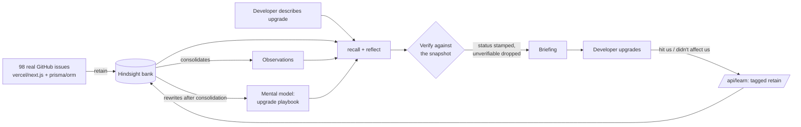

# Regression Radar

**Know what breaks before you upgrade, from a memory of real bug reports that gets better every time someone tells it what actually happened.**

**Live:** https://regression-radar.vercel.app

You describe an upgrade, for example *"Next.js 14.1 to 14.2, app router + Prisma"*. It answers with the specific things that broke for other people on that stack. Each one links to the real GitHub issue and says whether that issue has been fixed. When you report back what actually hit you, that report goes into memory and changes the answer for the next developer.

It is built on [Hindsight](https://github.com/vectorize-io/hindsight), an [agent memory](https://vectorize.io/what-is-agent-memory) system by Vectorize. Memory is not an add-on here. It is the product.

---

## The problem

When a team upgrades a framework, whatever breaks has usually already broken for somebody else, and it is written down in a public issue tracker. Nobody reads a few hundred bug reports before bumping a version number, so teams keep hitting the same regressions.

A general-purpose model doesn't solve this either. We asked one, with no memory, what breaks in this upgrade. It gave generic advice ("search the repo for the label"), hedged about the limits of its data, and cited GitHub issue numbers. **In every run we tried, none of the issue numbers it cited could be verified against our dataset.**

## What it does

```
POST /api/brief  { "stack": "Next.js 14.1 to 14.2, app router + Prisma" }
```

```jsonc
{
  "summary": "8 known breakages for this combination. 7 fixed, 1 still open.",
  "citations": { "total": 8, "verified": 8 },
  "risks": [
    {
      "title": "Inconsistent CSS resolution order",
      "status": "open",                 // from GitHub, never from the model
      "confidence": "high",
      "why": "layout.js imports override component-level CSS in production builds.",
      "sources": [{ "number": 64921, "url": "https://github.com/vercel/next.js/issues/64921" }],
      "feedback": { "hit": 0, "fine": 0 }
    }
  ],
  "memory_events": [ /* what memory was searched, what came back - see below */ ],
  "playbook": { /* Hindsight's mental model for this upgrade, verified */ }
}
```

Then, after the upgrade:

```
POST /api/learn  { "stack": "...", "feedback": [ { "number": 66248, "happened": true },
                                                 { "number": 65454, "happened": false } ] }
```

Ask the same question again. The warning that hit you moves to the top, marked *"Confirmed by 1 developer who did this upgrade"*. The one that didn't affect you drops to the bottom with low confidence.

---

## How Hindsight memory is used

Every answer draws on four kinds of memory. Each one is doing a separate job.

| Memory | What it holds here | How it gets there |
|---|---|---|
| **World facts** | What each of the 98 bug reports says: symptom, affected versions, workaround, fix | `retain()` of each cleaned issue. Hindsight's own extraction decides what counts as a fact. We never hand-sort. |
| **Observations** | Patterns across reports, e.g. several separate Prisma issues all failing the same way in edge runtimes | Consolidated automatically by Hindsight from the world facts. A typical query recalls **~80 memories: 48 world facts and 32 observations**. |
| **Developer reports** | "Issue #66248 DID happen to me", "#65454 did NOT affect me" | `/api/learn` retains each verdict with structured tags (`issue:66248`, `happened:yes`). Hindsight files these as world facts too, and consolidates them. |
| **Mental model** | A standing playbook: what usually breaks in this upgrade, grouped by area | `create_mental_model()` with a source query and `refresh_after_consolidation: true`. Hindsight rewrites it on its own. We watched it rewrite **22 seconds** after a developer report came in, and the new version mentioned that report. |

**The loop:**



Every response includes `memory_events`, which is exactly what memory did for that answer. The interface shows it live:

```
recall   searched memory, found 80 relevant memories       {world: 48, observation: 32}
recall   found 2 reports from developers who already did this upgrade
reflect  reasoned over 80 memories, produced 7 candidate risks
recall   loaded the mental model "What breaks upgrading Next.js 14.1 to 14.2...", rewritten by Hindsight at 08:56 UTC
reflect  applied developer reports: 1 warning confirmed, 1 marked as did not happen
reflect  dropped 1 citation not present in the 98-issue snapshot
```

`reflect()` does not report which memories it used, so the API runs `recall()` itself first. That way the inspector shows what actually came back rather than claiming it.

---

## Design decisions

### 1. Memory decides what is relevant. The snapshot decides what is true.

In the first working version, the model labelled **3 of 10** closed issues as still open (#64603, #66248, #64609). It was reading users write "still broken" in comments from months before the fix. It also cited #71281, which is not in the dataset.

So `reflect()` is never asked whether something is fixed. It returns issue numbers only, through a `response_schema`. Every status is stamped from the committed snapshot in [`lib/groundTruth.ts`](lib/groundTruth.ts), and any citation that is not in the snapshot is dropped rather than shown. A result you cannot click through to is worse than one fewer result.

The mental model gets the same treatment. Its first draft repeated the wrong status labels, and cited "#84901675" (an impossible number) for a problem whose real issue is #66248. Its text is now checked the same way before it is shown.

### 2. Feedback is stored as structure and applied in code

The first version of the learning loop passed developer outcomes to the model as context and asked it to act on them. It didn't follow the instructions: a warning a developer had confirmed came back with no mention of the confirmation, and a single report was counted as six, because Hindsight splits one report into several facts and observations. And since the model decides which warnings to include, nothing stopped a confirmed warning from dropping out of a later answer.

Now each verdict is its own memory with structured tags. On recall, it is counted **once per report**, because Hindsight splits one report into several facts and also consolidates reports into observations. The tally is applied deterministically:

- confirmed warnings go to high confidence and first place, and cannot drop out of later answers
- warnings developers said did not affect them go to low confidence and last place

`/api/learn` only accepts issue numbers that exist in the snapshot, so the public endpoint cannot write invented numbers into shared memory.

### 3. The before/after is a number, not an adjective

`/api/baseline` sends the same question, with no memory, to a capable general model (`openai/gpt-oss-120b` on Groq) and runs the same verification on its answer.

| | Issue numbers cited | Verifiable against the snapshot |
|---|---|---|
| Memory off (across our runs) | 0–5 | **0, every time** |
| Memory on (across our runs) | 7–12 | **all shown** (unverifiable ones are dropped) |

"Not verifiable" means the number is not in our 98-issue snapshot. It does not prove the number is invented, so we never claim that it is.

---

## The data

98 real issues, pulled by [`fetch_bug_reports.py`](fetch_bug_reports.py) and committed as [`raw_issues.jsonl`](raw_issues.jsonl):

| | |
|---|---|
| Sources | 25 from `vercel/next.js`, 73 from `prisma/orm` |
| State | 56 open, 42 closed |
| Created | 2024 onwards (Next.js 14.2 shipped April 2024) |
| With discussion | 84 include top comments, which is usually where the fix or workaround is |
| Duplicates / pull requests | 0 / 0 |

Nothing is fetched live while the app is running. The snapshot is the source of truth for status.

**What went wrong getting it:**

- GitHub's `search/issues` returns pull requests as well as issues. The first dataset was polluted with PRs until every query carried `is:issue`.
- Every Prisma query failed with HTTP 422. The repository was renamed from `prisma/prisma` to `prisma/orm`, and GitHub search's `repo:` qualifier does not follow the redirect.
- Sorting by "recently updated" surfaced Next.js 15 and 16 issues for a 14.2 question. Relevance ranking plus `created:>2024-01-01` fixed it.
- A token placed in `.env` was silently ignored, so the first full run crawled at 60 requests an hour instead of 5,000.

---

## Run it yourself

```bash
git clone https://github.com/ekupekuAI/regression-radar.git
cd regression-radar
cp .env.example .env          # fill in the four values
npm install
pip install hindsight-client

python fetch_bug_reports.py            # or use the committed raw_issues.jsonl
python load_to_hindsight.py init       # create the bank with its mission
python load_to_hindsight.py load       # retain all 98 issues
python load_to_hindsight.py mental-model
npm run dev                            # http://localhost:3000
```

| Variable | Purpose |
|---|---|
| `HINDSIGHT_API_URL`, `HINDSIGHT_API_KEY` | Hindsight Cloud instance. The loader and the app must point at the same one. |
| `GROQ_API_KEY` | The memory-off baseline (`openai/gpt-oss-120b` on Groq) |
| `GITHUB_TOKEN` | Only for re-fetching the data |

`python load_to_hindsight.py reset-feedback --yes` deletes every document that is not part of the snapshot and has Hindsight rewrite the playbook. Use it before a demo, so the before/after starts from memory nobody has given feedback to yet. Without `--yes` it is a dry run.

## API

| Endpoint | Body | Returns |
|---|---|---|
| `POST /api/brief` | `{ stack }` | `risks[]`, `citations`, `memory_events[]`, `playbook` |
| `POST /api/learn` | `{ stack, feedback: [{ number, happened }], outcome? }` | `recorded`, `rejected`, `memory_events[]` |
| `POST /api/baseline` | `{ stack }` | the no-memory `answer`, `citations` |

## Stack

Next.js 14 (App Router) on Vercel · Hindsight Cloud for memory (`retain`, `recall`, `reflect`, mental models) · Groq for the no-memory baseline · Python for the data pipeline.

## Limitations

- **Scope is one upgrade path.** Next.js 14.1 to 14.2 with the App Router and Prisma, on purpose. Covering "any stack" would mean a much larger ingest and per-stack verification.
- **"Closed" is treated as "fixed".** GitHub's `state_reason` would separate *completed* from *not planned*. That is the next thing to add.
- **Feedback is anonymous and unweighted.** One report counts the same as any other. At scale that needs identity and weighting.
- **Answers vary between runs.** The model is guided toward the 5–8 most relevant results, but which ones make the cut still shifts a little. Confirmed warnings are pinned, so they never drop out.

## Links

- Hindsight on GitHub: https://github.com/vectorize-io/hindsight
- Hindsight documentation: https://hindsight.vectorize.io/
- What agent memory is: https://vectorize.io/what-is-agent-memory
